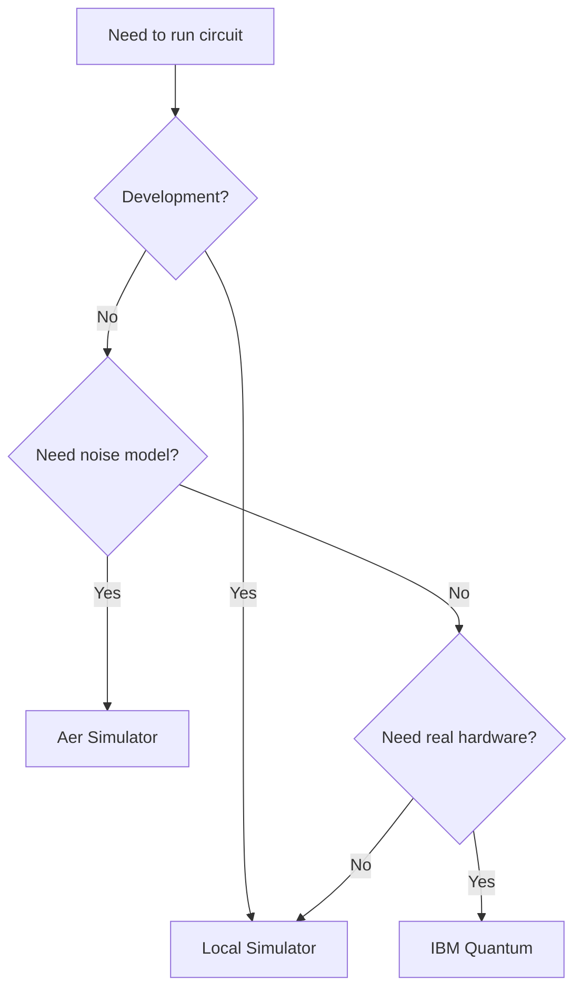

# Backend Guides

QuantSDK supports multiple backends for executing quantum circuits.
This section covers setup, configuration, and best practices for each.

## Available Backends

| Backend | Type | Setup | Max Qubits | Speed |
|---------|------|-------|------------|-------|
| [Local Simulator](local-simulator.md) | Simulator | None (built-in) | 24 | Fast |
| [IBM Quantum](ibm-quantum.md) | Real QPU + Sim | API token | 127+ | Queued |
| [Custom Backend](custom-backend.md) | Any | Implement ABC | Varies | Varies |

## Quick Comparison

### When to Use Each Backend



### Local Simulator
- **Best for:** Development, testing, learning
- **Pros:** Instant, free, no dependencies, reproducible with seeds
- **Cons:** Limited to 24 qubits, no noise modeling

### Aer Simulator
- **Best for:** Realistic simulation, noise studies, pre-hardware validation
- **Pros:** Noise models, high performance, GPU support
- **Cons:** Requires `qiskit-aer`, still classical simulation

### IBM Quantum
- **Best for:** Production, research papers, real quantum effects
- **Pros:** Real quantum hardware, up to 127+ qubits
- **Cons:** Queue times, noise, requires API token

## Backend Selection with `qs.run()`

```python
import quantsdk as qs

circuit = qs.Circuit(2).h(0).cx(0, 1).measure_all()

# Local (default)
result = qs.run(circuit, shots=1000)

# Aer
result = qs.run(circuit, backend="aer", shots=1000)

# IBM Quantum
result = qs.run(circuit, backend="ibm_brisbane", shots=1000, token="...")
```
